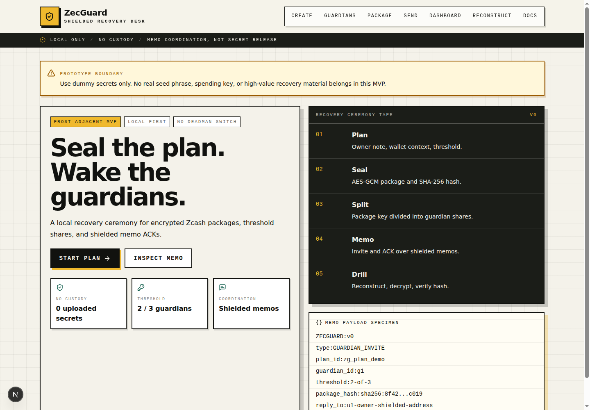

# ZecGuard


**Private guardian coordination and recovery readiness for Zcash users.**

ZecGuard is a local-first recovery readiness prototype. It helps a ZEC holder prepare an encrypted recovery package, split package access across trusted guardians, coordinate readiness through Zcash shielded memos, and run a reconstruction drill.

ZecGuard is **not** a deadman switch. It does **not** custody funds, upload seeds, decide whether someone is unavailable, automatically release secrets, or move ZEC.



Demo video: [cdn.jsdelivr.net/gh/Lexiie/ZecGuard@main/assets/demo.mp4](https://cdn.jsdelivr.net/gh/Lexiie/ZecGuard@main/assets/demo.mp4)

## What It Does

```text
Create -> Encrypt -> Split -> Send Memo -> Acknowledge -> Verify -> Reconstruct
```

- Creates a local recovery plan using demo-safe dummy material.
- Encrypts a recovery package locally with AES-GCM.
- Hashes the package and binds guardian shares to the plan/package hash.
- Splits the package encryption key into `2-of-3` guardian shares.
- Generates `ZECGUARD:v0` memo payloads for guardian invites, ACKs, and package anchors.
- Supports a local wallet bridge for memo sending and a manual copy/txid fallback.
- Scans local bridge memo output for matching guardian ACKs.
- Imports encrypted package/share JSON files for a reconstruction drill.
- Verifies decrypted package integrity against the original package hash.

## Safety Boundaries

- Use dummy secrets only in the MVP.
- Do not enter a real seed phrase, spending key, or high-value recovery material.
- Guardian shares are **not** sent through Zcash memos.
- Memos carry coordination data only: plan IDs, guardian IDs, statuses, hashes, and reply hints.
- The local bridge is optional; manual fallback must remain usable.
- This prototype has not received a production security review.

## Workspace

```text
apps/web      Next.js App Router frontend
apps/bridge   Local Fastify bridge for wallet memo operations
docs          Threat model, memo format, demo flow, architecture, roadmap
```

## Quick Start

Install dependencies:

```bash
npm install
```

Run the web app:

```bash
npm run dev:web
```

WSL-friendly web command:

```bash
npm run dev --workspace @zecguard/web -- -H 0.0.0.0 -p 3000
```

Run the optional local bridge:

```bash
npm run dev:bridge
```

Open:

```text
http://localhost:3000
```

Do not run `next build` while the dev server is running. If the dev server starts throwing missing chunk errors after a build, stop it, remove `apps/web/.next`, and restart it.

## Current MVP Demo Loop

1. Create a recovery plan with dummy material only.
2. Add three guardians and keep the `2-of-3` threshold.
3. Run the package drill to encrypt the package, hash it, split the package key, and generate memo payloads.
4. Download the encrypted package JSON and each guardian share JSON separately.
5. Send or copy the guardian invite memo. If the bridge is unavailable, paste a manual txid.
6. Sync and scan local bridge memos for ACKs, or paste a guardian ACK memo manually.
7. Import the encrypted package and two share files on the reconstruction page.
8. Reconstruct, decrypt, and verify the package hash.

## Memo Protocol

All ZecGuard memo payloads use this prefix:

```text
ZECGUARD:v0
```

Implemented MVP message types:

- `GUARDIAN_INVITE`
- `GUARDIAN_ACK`
- `PACKAGE_ANCHOR`

Example invite:

```text
ZECGUARD:v0
type:GUARDIAN_INVITE
plan_id:zg_plan_demo
guardian_id:g1
threshold:2-of-3
package_hash:sha256:...
reply_to:u1ownerDemoShieldedAddress
note:Please confirm ZecGuard recovery readiness. No secret is in this memo.
```

## Local Bridge

The bridge is optional and local-only. The web app defaults to:

```text
http://127.0.0.1:8787
```

Configure the web app:

```bash
NEXT_PUBLIC_ZECGUARD_BRIDGE_URL=http://127.0.0.1:8787
```

Configure the bridge:

```bash
ZECGUARD_BRIDGE_HOST=127.0.0.1
ZECGUARD_BRIDGE_PORT=8787
ZECGUARD_ZINGO_CLI=zingo-cli
```

Bridge API:

```text
GET  /health
POST /wallet/send-memo
GET  /wallet/memos
GET  /wallet/tx/:txid
POST /wallet/sync
```

The bridge maps these calls to the current `zingo-cli` commands: `quicksend`, `messages ZECGUARD:v0`, `sync run`, and `transactions`. Memo amounts entered as decimal ZEC are converted to zatoshis before broadcast.

## Validation

```bash
npm run typecheck
npm test
npm run build
```

Current core tests cover:

- AES-GCM encrypt/decrypt roundtrip.
- Raw key export/import.
- Shamir `2-of-3` reconstruction.
- Insufficient-share failure.
- Share plan/package-hash binding.
- Memo formatting/parsing/rejection.
- Memo scanning from bridge-style wallet output.

## Documentation

- [Hackathon submission notes](HACKATHON_SUBMISSION.md)
- [Threat model](docs/threat-model.md)
- [Memo format](docs/memo-format.md)
- [Demo flow](docs/demo-flow.md)
- [Architecture](docs/architecture.md)
- [Roadmap](docs/roadmap.md)

## License

MIT. See [LICENSE](LICENSE).
